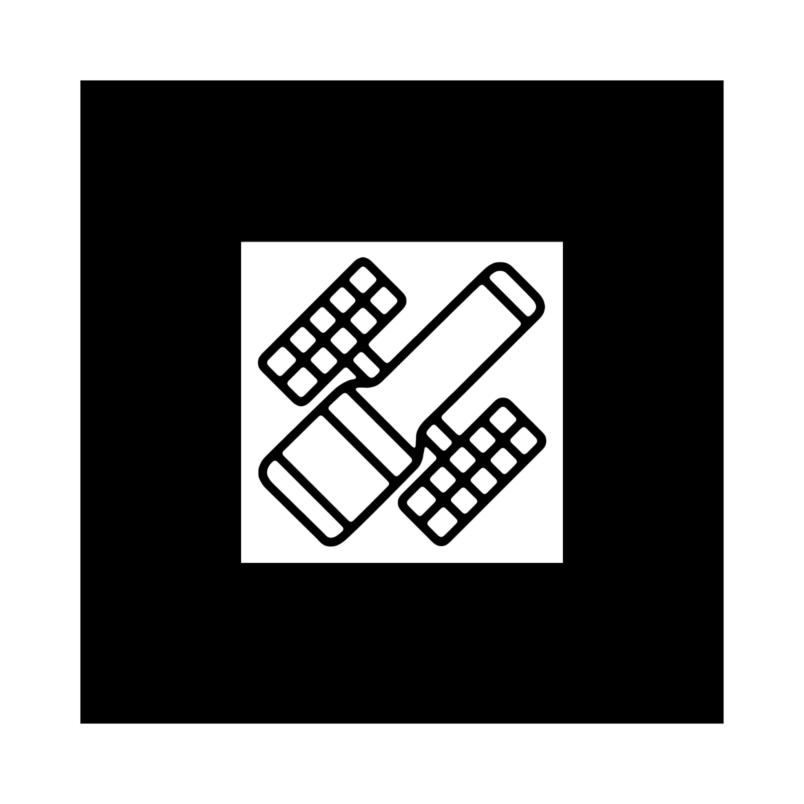

# ar
 AR Trackers for Cosmodome

# Instructions
Open the link or scan the QR, this will start the experience in the browser, no app download is required.

- Allow camera access
- Aim one of the target marken with your phone camera
- You should see an holographic 3D model appearing on your phone
- If nothing happen try to get closer of the marker

https://cosmodome-org.github.io/ar/

# FR / EN
Toggle FR/EN top right to change language
